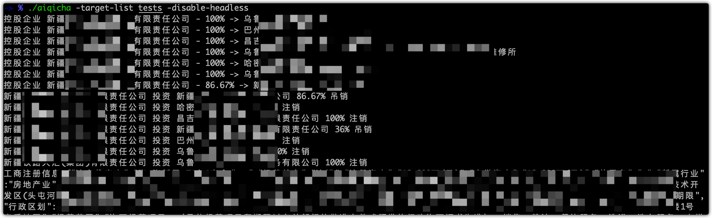
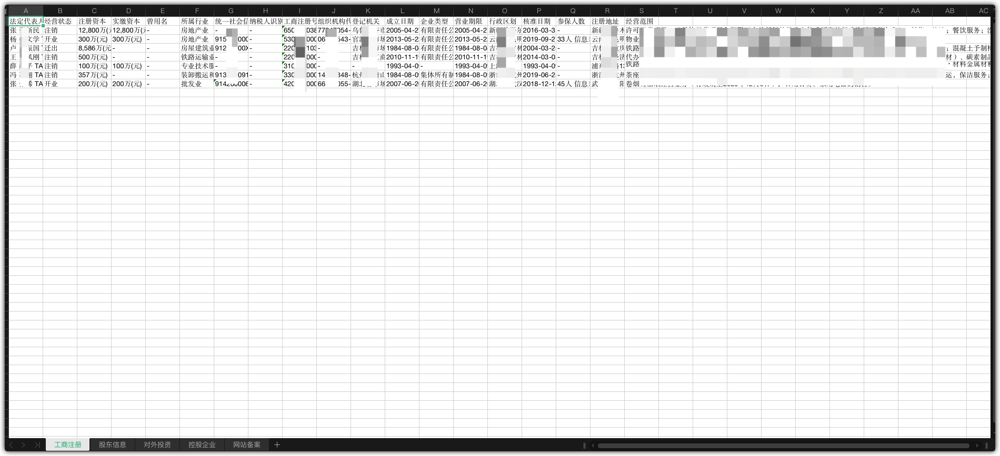
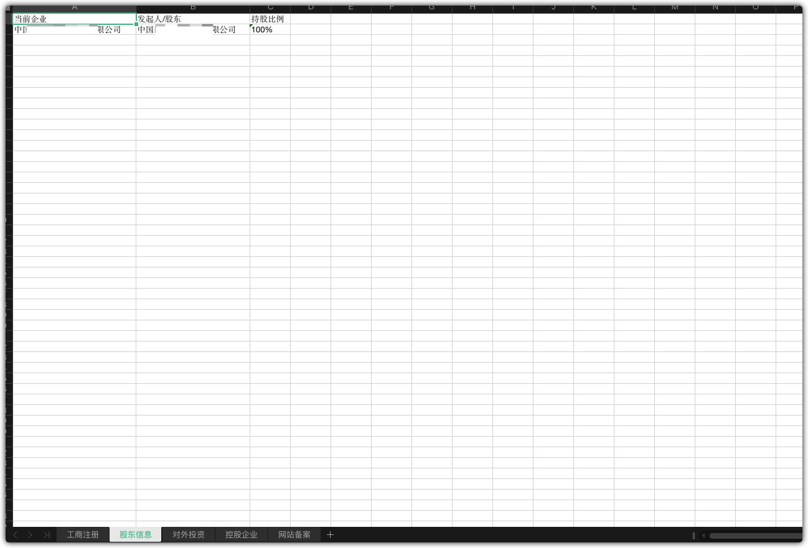
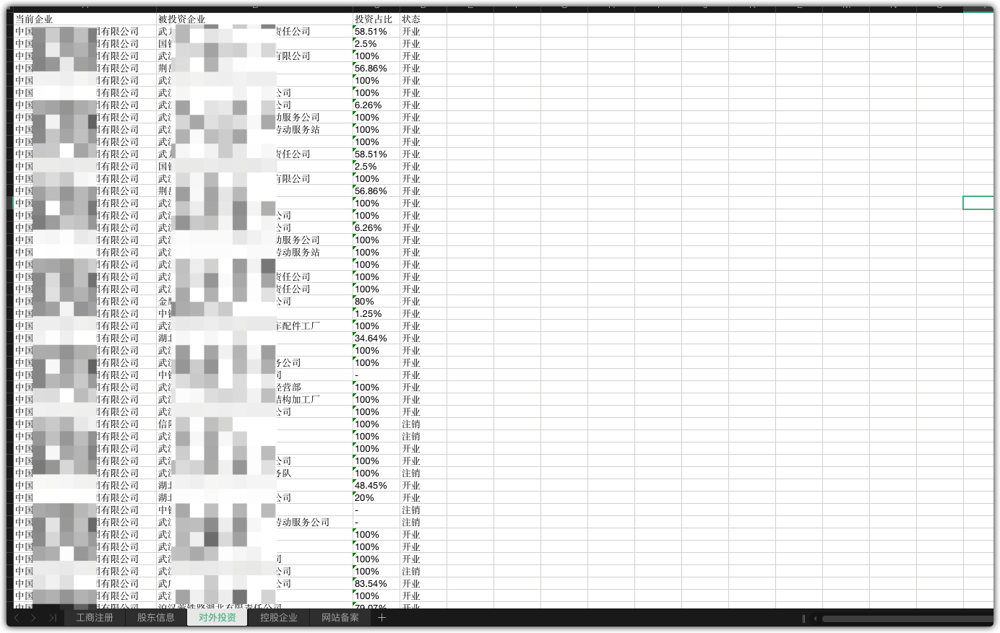
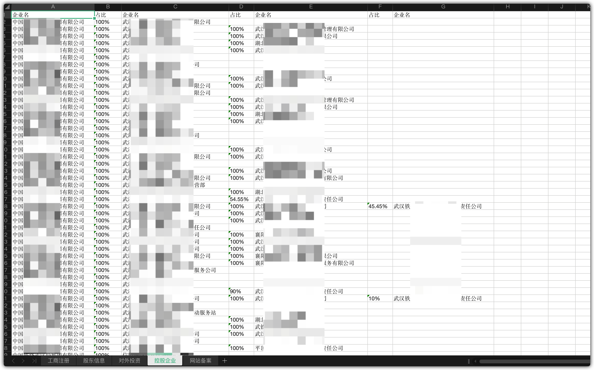
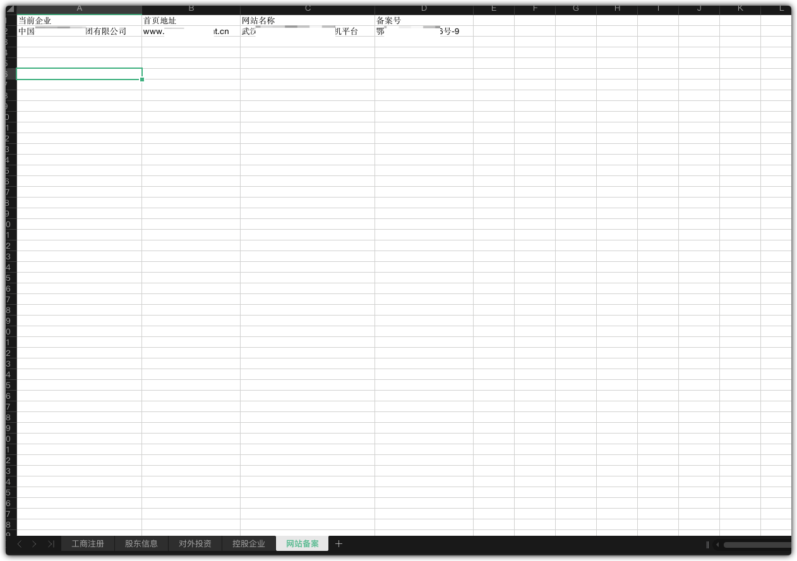

## 简介

> 基于无头浏览器查询 爱企查 内的企业信息

## Usage

```bash
Usage of ./aiqicha:
  -chrome-path string
    	chrome path
  -disable-headless
    	disable chrome headless model
  -output string
    	output file name (default "2021_09_28_15_53_27")
  -proxy string
    	proxy
  -target string
    	target
  -target-list string
    	target list
  -timeout int
    	timeout (default 3600)
```

📢: 重启机器后的第一次启动都会要求登录账号(启动之后正常的登录账号就行)

📢: 如果迟迟没有结果输出的时候，可以使用 -disable-headless 启动，查看原因

📢: cookie信息存储在 '/tmp/cookies.aiqicha' 内，可以上传到其它平台使用

## 结果













## TODO

- [x] 基础信息
  - [x] 工商注册
  - [x] 股东信息
  - [x] 对外投资
  - [x] 控股企业
- [x] 知识产权
  - [x] 网站备案
- [ ] 公众号、小程序、APP
